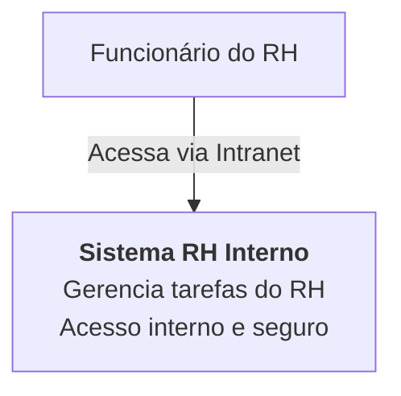
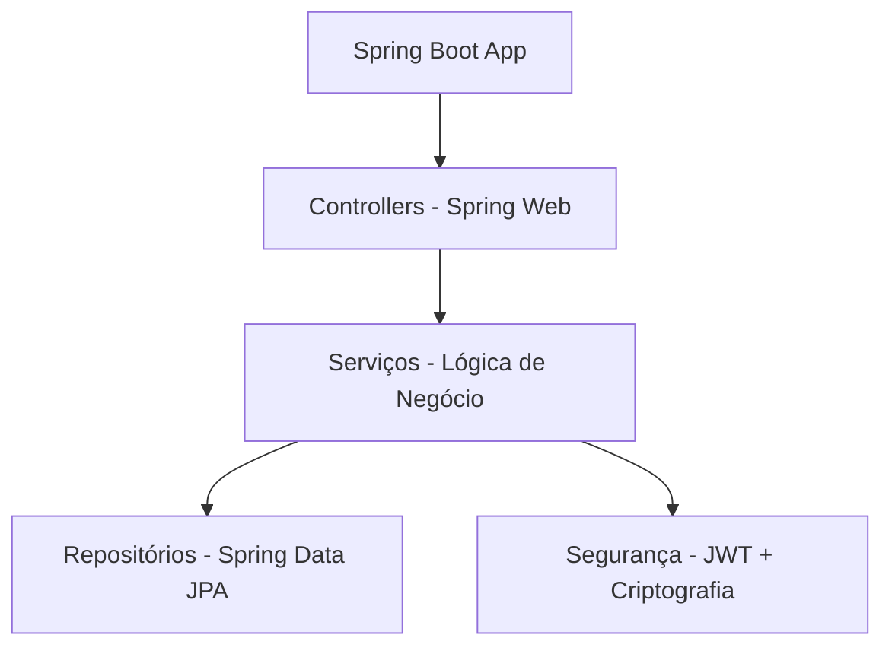
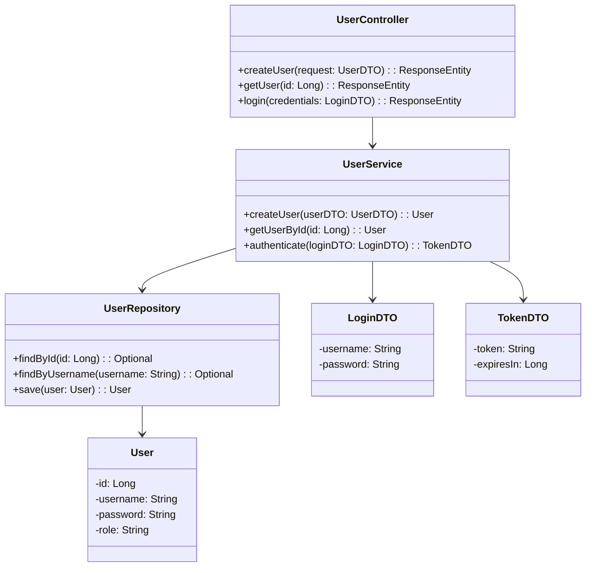

## 🛠️ Sistema RH Interno - Arquitetura de Software

Este projeto foi desenvolvido como solução para um sistema interno de **gestão de tarefas do RH** de uma grande empresa de automóveis. O foco é garantir **segurança, controle de acesso, e operação restrita à intranet corporativa**.

---

## 📌 Resumo da Arquitetura

- 💻 Aplicação Web segura, acessada via navegador (thin client).
- 🔐 Controle de acesso com autenticação forte (criptografia de senha, JWT).
- 🧠 Backend desenvolvido com **Kotlin + Spring Boot**.
- 🛡️ Acesso 100% interno (intranet), sem exposição externa.
- 🗄️ Banco de dados relacional seguro (PostgreSQL / Oracle).

---

## 🔷 Diagrama de Contexto (C1)



---

## 🧱 Diagrama de Contêiner (C2)

```mermaid
graph TD
    A[Funcionário do RH] --> B[Navegador Web (Thin Client)]
    B --> C[Aplicação Backend - Spring Boot (Kotlin)]
    C --> D[Camada de Autenticação - Spring Security]
    C --> E[Banco de Dados Interno<br/>(PostgreSQL/Oracle)]
```

---

## 🧩 Diagrama de Componentes (C3)



---

## 🧬 Diagrama de Código (C4)



---
